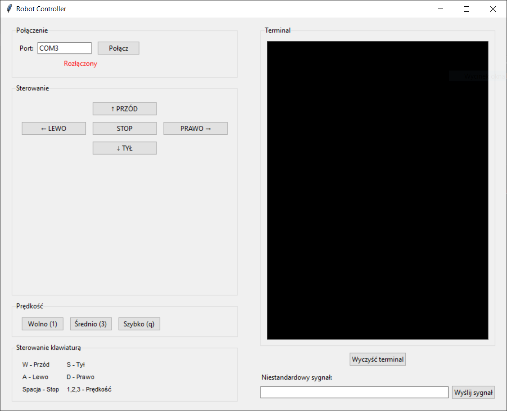
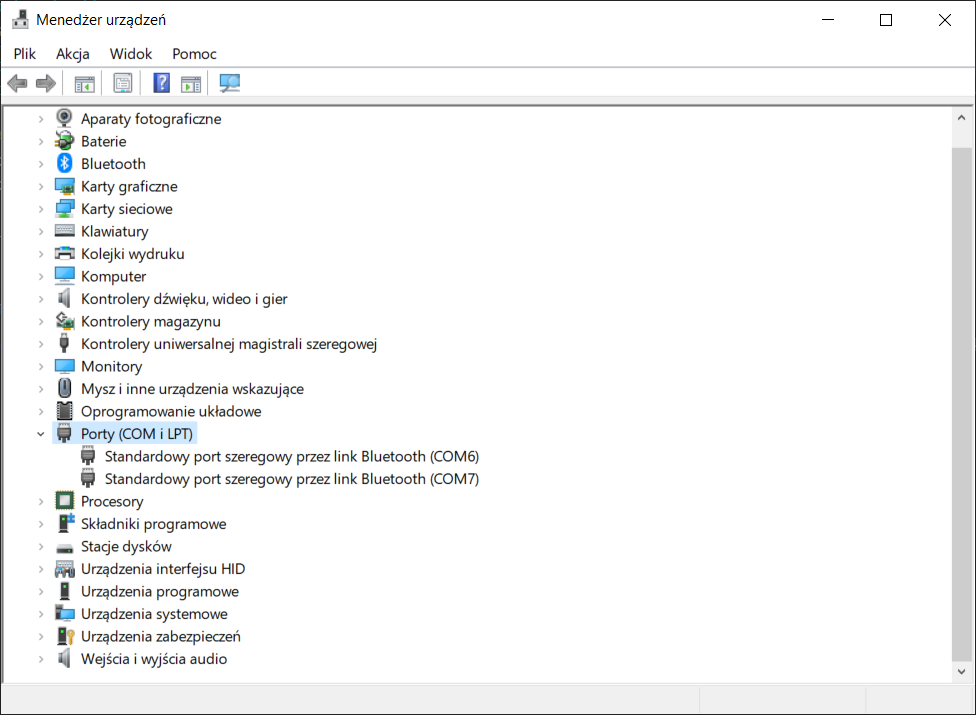
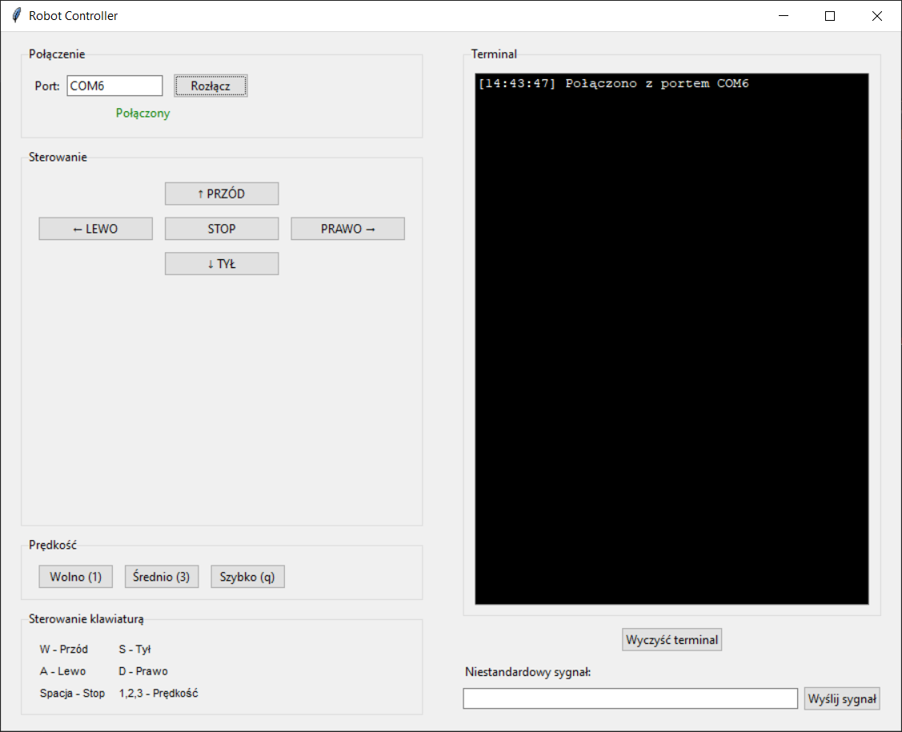
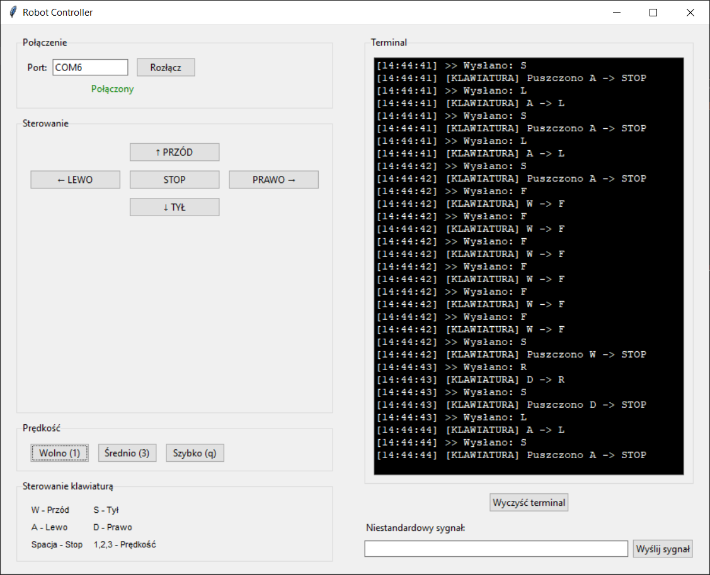

## 🤖 Robot Controller – README

### 📝 Opis projektu

**Robot Controller** to aplikacja desktopowa (Python + Tkinter), która umożliwia sterowanie robotem przez port szeregowy (np. Bluetooth/USB) za pomocą klawiatury lub przycisków GUI. Program pozwala na wybór portu COM, wysyłanie poleceń ruchu, zmianę prędkości oraz podgląd komunikacji w terminalu. Idealne narzędzie do testowania i obsługi pojazdów RC, robotów mobilnych czy innych urządzeń sterowanych przez UART/Serial.

---

### 🛠️ Funkcje

- 🔌 Wybór portu COM i szybkie łączenie/rozłączanie
- 🎮 Sterowanie ruchem robota:
  - ⬆️ Przód, ⬇️ Tył, ⬅️ Lewo, ➡️ Prawo, ⏹️ Stop (przyciski i klawiatura)
- 🚦 Trzy tryby prędkości (wolno, średnio, szybko)
- 🖥️ Terminal z logowaniem wysyłanych i odbieranych sygnałów
- ✉️ Wysyłanie niestandardowych komend
- ⌨️ Obsługa skrótów klawiaturowych:
  - W – przód
  - S – tył
  - A – lewo
  - D – prawo
  - Spacja – stop
  - 1, 2, 3 – prędkość

---

### 📦 Wymagania

- Python 3.x
- Biblioteki: `tkinter`, `pyserial`

Instalacja wymaganych bibliotek:
```bash
pip install pyserial
```

---

### ⚡ Uruchomienie

1. 🔗 Podłącz robota przez port szeregowy (np. Bluetooth lub USB).
2. 🖥️ Sprawdź numer portu COM w Menedżerze urządzeń (np. COM6).
3. ▶️ Uruchom aplikację:
   ```bash
   python rcar-control-app.py
   ```
4. 🟢 Wybierz odpowiedni port COM z listy i kliknij **Połącz**.
5. 🎛️ Steruj robotem przyciskami w GUI lub klawiaturą.

---

### 🖼️ Zrzuty ekranu

#### Widok główny po uruchomieniu


#### Menedżer urządzeń Windows – sprawdzenie portu COM


#### Łączenie z portem COM


#### Wysyłanie komend


---

Po wybraniu portu i kliknięciu **Połącz**, aplikacja nawiązuje połączenie szeregowe z robotem.

- Komendy można wysyłać za pomocą przycisków w interfejsie lub skrótów klawiaturowych.
- Terminal po prawej stronie wyświetla wszystkie wysłane i odebrane wiadomości wraz ze znacznikiem czasu.
- Możliwe jest również wysyłanie dowolnych sygnałów poprzez pole **„Niestandardowy sygnał”**.
---

### 🎯 Mapowanie komend

| Klawisz/Przycisk | Komenda do robota |
|------------------|-------------------|
| W / ↑ PRZÓD      | F                 |
| S / ↓ TYŁ        | B                 |
| A / ← LEWO       | L                 |
| D / → PRAWO      | R                 |
| Spacja / ⏹️ STOP | S                 |
| 1                | 1 (wolno)         |
| 2                | 3 (średnio)       |
| 3                | q (szybko)        |

---

### ❓ FAQ

**1. Nie widzę portu COM w aplikacji – co zrobić?**  
Sprawdź w Menedżerze urządzeń, czy urządzenie jest poprawnie podłączone i widoczne jako port szeregowy.

**2. Po kliknięciu „Połącz” pojawia się błąd.**  
Upewnij się, że wybrany port nie jest zajęty przez inne aplikacje i masz uprawnienia do jego użycia.

**3. Jak dodać własną komendę?**  
Wpisz ją w polu „Niestandardowy sygnał” i kliknij „Wyślij sygnał”.

---

### 👨‍💻 Autor

Projekt stworzony dla entuzjastów robotyki i automatyki.  
Masz pytania lub chcesz rozwinąć projekt? Śmiało forkuj repozytorium i zgłaszaj pull requesty!

---

**Steruj swoim robotem jak chcesz – szybko, wygodnie i z pełną kontrolą!**

